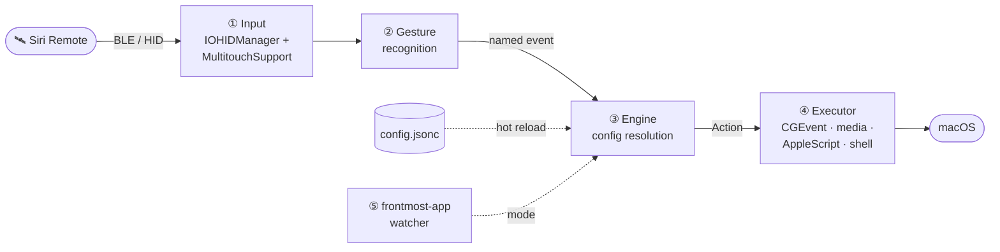
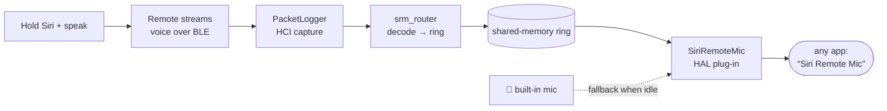

<div align="center">


# 🛰️ SiriRemoteForge

### Thirteen buttons. However many meanings you want.

[](LICENSE)
&nbsp;
&nbsp;
&nbsp;
&nbsp;

*The Apple TV remote in your drawer already has a compact touch surface and thirteen buttons.*
*This turns it into a Mac controller where **you** decide what each of them means — and where the*
*meaning changes with whichever app you happen to be looking at. If you're brave, it can even become*
*a microphone.*

</div>

---

> **TL;DR** — Remap every button, the click-ring, the trackpad, and swipes to any action; make one
> key mean six things; swap the whole remote with layers; drive the cursor from the touch surface; and
> reconfigure the entire device by editing **one hot-reloading file**. No settings screen required.

```jsonc
// Back button: tap deletes, hold half a second closes the window,
// hold a bit longer quits the app. Each delay is set independently.
"button.menu":       { "action": "keystroke", "keys": "delete" },
"button.menu.hold":  { "action": "closeWindow", "after": 0.5 },
"button.menu.hold2": { "action": "applescript", "after": 1.2, "script": "…" },

// …but in a browser, "back" means back.
"browser": {
  "button.menu": { "action": "keystroke", "keys": "cmd+[" }
}
```

Save the file and it takes effect. No restart, no reconnect, no settings screen to click through —
which also means an agent or a script can reconfigure the whole device by editing one file.

**What you get**

- Every input is remappable: buttons, the click-ring, the trackpad, swipes, two-finger tap.
- A key can mean up to six things — tap, double-tap, triple-tap, and up to three long-press
  stages, each with its own delay. An on-screen card shows what you'll get if you let go now, and holding past the
  last stage cancels.
- Per-app profiles that fall through an inheritance chain, plus **layers** that swap the whole
  remote at once (momentary while held, or sticky).
- The touch surface drives the cursor with tunable acceleration, iPod-style circular scroll, sticky drag,
  shake-to-find, and press-to-click.
- A radial app launcher, animated Space switching, window controls, brightness, and a native
  settings app with a drawn, clickable remote.

> **Scope.** macOS only, and it uses private frameworks (MultitouchSupport, SkyLight) to reach the
> trackpad and Spaces. The current build is therefore unsandboxed and distributed directly rather
> than through the Mac App Store; a supported public input API and entitlement path would be needed
> for a conventional sandboxed distribution. Build it
> yourself or use a beta GitHub Release when available. Release builds are ad-hoc signed, not
> Apple-notarized, and need a one-time right-click → Open. This is a power tool, and it asks for the
> permissions it needs: Accessibility and Input Monitoring.

---

## What it does

- **Everything is remappable.** Buttons (Back/Menu, TV, Siri, Play/Pause, Mute, Volume ±, Power),
  the click-ring (up/down/left/right + center), one-finger swipes, and two-finger tap — each maps
  to any action.
- **Trackpad → cursor.** The remote's touch surface drives the mouse pointer with tunable speed,
  a steadiness dead-zone, velocity-based pointer acceleration, press-to-click freeze, tap-to-click,
  and iPod-style **circular scroll** (circle a finger on the outer ring to scroll).
- **Per-app profiles.** The frontmost app selects a *mode* (e.g. a browser mode, a terminal mode);
  bindings fall through a `inherits` chain to a global default, then to the remote's native behavior.
- **Layers.** A key can toggle a **layer** (like a keyboard layer): tap it to switch a sticky layer
  on/off, or hold it for a momentary layer. Layers **compose with the app** — the same layer can do
  different things in different apps. An on-screen HUD confirms the switch.
- **Multi-stage long-press** (`.hold` / `.hold2` / `.hold3`, release-to-select), **multi-tap**
  (`.double` / `.triple`), and **hold-to-repeat** (auto-repeats a keystroke while held).
- **Extras:** power button dims all displays *instead of sleeping or locking the Mac* (macOS's own
  power-button hotkey is suppressed for the remote only — your Mac's physical power button is
  untouched), and any touch restores them; a HUD confirms the remote connecting and disconnecting;
  shake the cursor to flash a "find my pointer" highlight; animated macOS **Spaces** switching.
- **Two ways to configure:** hand-edit `~/.config/siriremote/config.jsonc` (hot-reloads on save), or
  use the built-in **Settings** app — a Tuning tab (sliders) and a Layout tab (a drawn remote + an
  inline, click-to-edit mapping editor with per-app layers).

---

## How it works



The shipping app has two Swift halves, plus a self-contained virtual-microphone subsystem and an
older DriverKit experiment:

- **`SiriRemoteCore/`** — a pure-Swift, dependency-free, unit-tested engine (a SwiftPM package). It
  owns the config model (JSONC parsing, the `Action` enum, per-app modes + `inherits` resolution,
  layers, multi-stage hold thresholds), the config **write-back** (serialize a `Config` back to
  JSONC so a UI edit round-trips), and the circular-scroll math. No AppKit, no I/O — trivially
  testable (`swift test`).
- **`app/`** — the native macOS layer built with `swiftc` (see `app/build.sh`). It seizes the remote
  over HID (`IOHIDManager`), reads the trackpad via the private `MultitouchSupport` framework,
  recognizes gestures, watches the frontmost app, and executes actions with CGEvent / media-key /
  AppleScript / shell. It also hosts the SwiftUI **Settings** window. The core package is compiled
  straight into this binary (no separate library).
- **`mic/`** — the working **virtual microphone**: a CoreAudio HAL plug-in that publishes a
  "Siri Remote Mic" input device, fed by a Bluetooth-voice router and an on-demand root daemon.
  See [🎙️ Turn the remote into a microphone](#microphone).
- **`deprecated/driverkit/`** — archived HIDDriverKit microphone-replacement proof of concept,
  superseded by `mic/`. It is historical reference only and is not part of the active build.

---

## Requirements

- macOS 13+ (Ventura or later), Apple silicon or Intel.
- A **3rd-generation Siri Remote** (2022, USB-C). Pair it over Bluetooth first (hold it near the Mac;
  it appears as a keyboard/trackpad device).
- Xcode command-line tools (`xcode-select --install`) for `swiftc`.

**No third-party tools.** Animated Space switching was once routed through BetterTouchTool; it now
goes through System Events, which needs Automation permission (macOS asks once) — see the `space`
action.

---

## Install a beta build

Published beta builds on the
[Releases page](https://github.com/HOLODATA-COM/SiriRemoteForge/releases) provide three Apple-silicon
downloads:

- **Native Full Installer (recommended)** — open `HyperVibe-Full-Setup-…-arm64.pkg`. The standard
  macOS Installer places the app, Siri Remote Mic system components, background service and
  uninstaller with one administrator approval. HyperVibe then opens a live System Check for the
  privacy choices macOS does not let an installer make on the user's behalf.
- **App only** — unzip `HyperVibe-…-macOS-arm64.zip`, move `HyperVibe.app` to Applications, then
  right-click → **Open** once.
- **Legacy Full Setup** — adds the Siri Remote Mic system components and
  `HyperVibe Uninstall.app`. It asks for an administrator password, briefly restarts system audio,
  and runs a 25-second `coreaudiod` safety check with automatic plug-in rollback.

Both require macOS 13+ and are currently arm64-only. Source builds can still be made locally. The
beta archives are ad-hoc signed rather than Apple-notarized because the hardened runtime terminates
the private MultitouchSupport callback used by the remote trackpad.

---

## Build & run

```sh
cd app
./build.sh              # compiles the app + SiriRemoteCore into ./HyperVibe
./create_app_bundle.sh  # wraps it into HyperVibe.app (icon auto-generated, code-signed)
open HyperVibe.app
```

`build.sh` produces a bare `./HyperVibe` you can also run directly (`./HyperVibe --settings` opens
the settings window on launch; `--system-check` opens the live readiness screen).
`create_app_bundle.sh` packages a double-clickable `HyperVibe.app`.

**It's a menu-bar app** (no Dock icon): after launching, click the walkie-talkie icon in the menu bar
for **Settings… / Quit**. If the menu-bar icon is hidden (e.g. behind the notch), just **double-click
`HyperVibe.app` again** — that reopens the Settings window.

### Permissions

macOS gates the low-level access this app needs. On first run HyperVibe opens **System Check**, which
shows the live state of every required and feature-specific capability. Permission requests happen
only after the user clicks the matching row; normal startup never sprays unexplained TCC prompts.
The two core permissions are:

- **Accessibility** — to move the cursor and post keystrokes.
- **Input Monitoring** — to receive the remote's buttons over HID. If the buttons don't respond,
  this is almost always why (the log shows `IOHIDManagerOpen failed 0xE00002E2`).

When either permission is granted, HyperVibe automatically reattaches the affected HID/event-tap
subsystem; the user does not have to quit or restart the app. The same System Check also reports
Microphone, Automation, Siri Remote Mic components and PacketLogger, and remains available from the
menu bar and Settings.

The outer bundle is signed **without** the hardened runtime on purpose — under the hardened runtime
the private MultitouchSupport touch callback trips code-signing enforcement and the app is killed the
instant you touch the trackpad. Development builds in this fork use the developer's own
`Apple Development:` identity (or an explicit `HYPERVIBE_SIGN_ID`) and never silently fall back to
ad-hoc signing. The default fork bundle id is `org.tevriq.siriremoteforge`; override it with
`HYPERVIBE_BUNDLE_ID` when needed. Changing certificate or bundle id is a macOS code-identity
migration and may require granting TCC permissions again.

### Software updates

Packaged release builds can use Sparkle for updates. Local `-local.` development builds disable
Sparkle entirely, including manual checks, and do not embed a feed URL or update public key.
A non-local release build must explicitly provide this fork's own `HYPERVIBE_UPDATE_FEED_URL` and
`HYPERVIBE_UPDATE_PUBLIC_KEY`; packaging fails if either is missing. Do not reuse the inherited
upstream appcast/key for this fork. Sparkle verifies every archive against the explicitly supplied
Ed25519 public key before extraction.
The updater replaces only `HyperVibe.app`, so ordinary updates neither restart system audio nor ask
for an administrator password. Full Setup remains a separate manual download for installing or
refreshing the virtual microphone stack.

Both behaviours are controlled by `settings.automaticUpdateChecksEnabled` and
`settings.automaticallyDownloadUpdatesEnabled` in `config.jsonc`, and both default to `true`.

### Required system setting if you bind the Power button

**Only needed if you map `button.power`.** Skip this otherwise.

macOS translates the remote's Power button into the *system* power-button hotkey. `loginwindow`
acts on that (`PBSleepsMachine`) and sleeps/locks the Mac — **in addition to** running whatever you
bound, so a Power binding would dim your screen *and* lock it. Turn that behaviour off:

```sh
sudo defaults write /Library/Preferences/com.apple.loginwindow PowerButtonSleepsSystem -bool false
```

It takes effect immediately (loginwindow re-reads the pref on every press). To undo, write `true`.

**What this changes:** your Mac's own physical power button no longer sleeps the machine on a short
press. Touch ID, holding it for the force-shutdown dialog, closing the lid, and the Apple menu's
Sleep all keep working.

**Getting sleep back on the remote** — bind a long press, which the app *can* control:

```jsonc
"button.power":      { "action": "brightness", "value": 0.0 },          // tap → dim
"button.power.hold": { "action": "shell", "command": "pmset sleepnow" } // hold ≥ holdThreshold → sleep
```

> **Why not just intercept the event?** It was tried thoroughly and it cannot work. Measured
> directly: with a `CGEventTap` consuming **all 33** of the power events it saw, and with all seven
> of the remote's HID interfaces seized, `loginwindow` still received the button and slept the Mac.
> It reaches loginwindow by a path userspace cannot intercept, so the preference above is the only
> real lever. Short presses *appeared* to work only because loginwindow debounces them at 350 ms —
> which is also why long presses failed every time. See `HANDOFF.md` for the full evidence.

Pressing Power also opens a **1-second input guard**: the button sits right next to the touch surface, so
the press almost always brushes the trackpad, which used to instantly undo the dim it had just
triggered. During the guard, touches and other buttons are still read but do not fire actions.

---

<a id="microphone"></a>

## 🎙️ Turn the remote into a microphone

The 3rd-gen Siri Remote has a genuinely good close-talk microphone — the one you'd hold up and speak
into. macOS never exposes it (it isn't a standard Bluetooth audio device), so `mic/` builds one: a
CoreAudio device named **"Siri Remote Mic"** that any app can select.

**Hold the Siri button and speak → your voice arrives from the remote's close mic. Let go → it
seamlessly falls back to the Mac's built-in mic.** Pair that with a push-to-talk binding and it's a
dictation setup where the mic is always in your hand.



Under the hood: an on-demand **root LaunchDaemon** (`mic/captured/`) runs Apple's PacketLogger only
while some app is actually using the device; **`srm_router`** (`mic/router/`) decodes the remote's
proprietary BLE voice notifications into a lock-free shared-memory ring; and a **HAL plug-in**
(`mic/driver/`, a hardened fork of [BlackHole](https://github.com/ExistentialAudio/BlackHole))
serves that ring — or the built-in-mic fallback ring — to CoreAudio, crossfading on every hand-over.

> [!IMPORTANT]
> **This half is power-user territory and has real caveats:**
> - It requires Apple's **PacketLogger** (free, in [*Additional Tools for Xcode*](https://developer.apple.com/download/all/?q=Additional+Tools+for+Xcode)) at `/Applications/PacketLogger.app` — it is **not** bundled.
> - It installs a HAL plug-in into `coreaudiod` and a root daemon. When PacketLogger is available,
>   the daemon enables Bluetooth HCI debug traces for capture; without PacketLogger it leaves those
>   traces unchanged. This is a system-level feature; read `mic/README.md` first.
> - It works by **interoperating with Apple's undocumented remote-voice protocol** (reverse-engineered). It's a research/interop feature, is fragile across macOS versions, and carries a small (~1–2 s) switch latency.

The advanced Full Setup Release asset installs the complete stack behind a watchdog and adds a
dedicated uninstaller. Development setup and component-level details live in
[`mic/README.md`](mic/README.md); release packaging lives in [`dist/`](dist/README.md).

---

## Native voice-to-text

HyperVibe can also turn a side-button hold directly into text, without asking another dictation app
to interpret a shortcut. No `pushToTalk` mapping is required: enable **Settings → Voice**, save an
OpenAI key from the in-App credentials panel, then
hold the Siri button for 0.2 seconds and speak. Capture and the cloud session begin on the physical
press edge, underneath that existing tap/hold decision; a quick tap cancels silently. Releasing the
button immediately closes the live Voice presentation and finishes the current utterance in the
background.

There are two deliberately different output paths:

- **Streaming** prioritizes responsiveness. Transcript deltas are inserted as they arrive while the
  button is still held; the first delta bypasses coalescing, later deltas are batched for at most
  8 ms, and no LLM rewrite is put in the latency path. On a successful release the widget returns
  directly to the current Layer—there are no redundant Transcribing, Inserting, or Inserted cards.
  Clipboard fallback and errors remain visible because those outcomes require attention.
- **Final** records the complete utterance with `gpt-transcribe`, applies the on-device dictionary,
  and can optionally polish wording with a small OpenAI or DeepSeek model. DeepSeek is the default
  cleanup provider because it is materially faster in this workflow; choose `none` for the shortest
  release-to-text path.

The side button can choose a different route on every configured Layer. `existing` leaves that
Layer's ordinary `button.siri` binding completely untouched, while `final` and `streaming` select
the two native paths above. HyperVibe keeps at most one warm Realtime session per native path—not
one per Layer—so even a ten-Layer configuration uses at most two prepared sockets and switching
Layers does not put a fresh TLS/session handshake on the next press.

The capture path automatically prefers fresh Siri Remote audio when the Full Setup microphone stack
is available, then falls back to the Mac's built-in microphone. It locks onto the first viable source
after a short pre-roll so source probing does not continue to consume work during the utterance.
Audio conversion is allocation-light, HTTP/TLS and the Realtime WebSocket are pre-warmed before the
next press, and credentials are cached before the input hot path.

Text delivery first targets the control that was focused when the press began. Ordinary Final Voice
uses a guarded compatibility paste, then direct Accessibility and Unicode paths, and finally copies
the result if the target cannot accept text. It refuses to inject into secure text fields. If a previous result did not land
where expected, double-clicking the side button copies that previous dictation again. A custom
dictionary accepts canonical terms plus recognition aliases and works in both modes.

When editable text is already selected, Voice becomes a selection editor: hold Side, speak the
transformation, and release to replace the selection once. This route is deliberately Accessibility-
only. HyperVibe never simulates Copy to discover the selection and never inserts the spoken
instruction. Editable selections are replaced in place. Readable terminal/scrollback selections can
still be rewritten, but their result is clipboard-only; any failed replacement likewise copies the
completed rewrite while leaving the source untouched. It works with both Final and Live
transcription; the edit model is configured independently from transcript cleanup.

Native Voice gives immediate press/release confirmation with a matched pair of short sound cues.
The stop sound starts only after microphone capture has ended, so it cannot become part of the
transcript. Switching Voice mode itself is silent. The persistent widget uses the same real acoustic
meter in Final and Streaming, with an adaptive per-hold level reference so changing microphone sources does not arbitrarily
make the waveform huge or tiny. Both the cue and its volume are configurable.

API keys are entered only through HyperVibe Settings and never enter the shareable `config.jsonc`,
logs, the App bundle, or Git. Certificate-bound builds keep them in the login Keychain through a
fixed credential helper. Public ad-hoc betas instead keep them as plaintext in a dedicated
`~/Library/Application Support/HyperVibe/Credentials/credentials.json` file with mode `0600` inside
a mode-`0700` directory. This protects against accidental sharing, not malware already running as
the signed-in user. Every non-secret behavior remains JSON-controlled under `settings.dictation`:

```jsonc
"dictation": {
  "enabled": true,
  "activeMode": "final", // external | final | streaming; global on every Layer
  "outputMode": "final", // legacy downgrade compatibility
  "layerModes": {},      // deprecated compatibility; activeMode is authoritative
  "finalModel": "gpt-transcribe",
  "streamingModel": "gpt-live-transcribe",
  "languageHints": ["zh", "en"],
  "cleanupProvider": "deepseek", // none | openai | deepseek; Final mode only
  "selectionEditingEnabled": true, // selected text + spoken instruction → strict AX replacement
  "selectionEditProvider": "deepseek", // openai | deepseek
  "openAICleanupModel": "gpt-5.6-luna",
  "deepSeekCleanupModel": "deepseek-v4-flash",
  "autoInsert": true,
  "copyOnFailure": true, // compatibility field; failed delivery is always copied
  "restoreClipboardAfterInsert": true,
  "copyLastOnSideButtonDouble": true,
  "feedbackSoundsEnabled": true,
  "feedbackSoundVolume": 0.55,
  "pipelineOverlayEnabled": true, // temporary draggable Voice capsule
  "minimumRecordingSeconds": 1,   // shorter turns stay local and produce no text
  "maxRecordingSeconds": 120,
  "dictionary": [
    { "term": "HyperVibe", "aliases": ["hyper vibe", "Hyper Vibe"] }
  ]
}
```

Voice mode is orthogonal to Layer: changing Layer never changes the selected route. Hold **Mute**
and tap the side button to cycle **External → Final → Live** without adding any delay to ordinary
side-button input. Both floating surfaces animate the selection; External leaves the configured
`button.siri` action untouched and never opens the temporary Voice capsule.

The temporary Voice capsule is independent from the always-on Layer status widget. In Final and
Live it appears only after the native hold threshold and carries the real acoustic waveform into
Final mode's Transcribing → Polishing → Inserted pipeline, or an edit's Transcribing → Rewriting
Selection → Selection Updated pipeline. It remembers its display-relative drag position and automatically
returns to an available screen if a monitor disappears. Set
`pipelineOverlayEnabled` to `false` to hide it without changing dictation or the persistent widget.

The Voice settings page exposes the same fields, credential connection tests, and the most recent
press-to-audio, session-ready, first-delta, release-to-transcript, cleanup, and insertion timings.

---

## Configuration — `~/.config/siriremote/config.jsonc`

JSONC (JSON + `//` comments). A default is written on first run. **Saving hot-reloads it live.**
Three top-level keys: `settings`, `appProfiles`, `modes`. A complete, working example to crib from
lives in [`examples/config.jsonc`](examples/config.jsonc), and the maintainer's actual daily-driver
setup — push-to-talk, per-app Music/browser/terminal modes, layers — is in
[`examples/config.author.jsonc`](examples/config.author.jsonc).

```jsonc
{
  "settings": {
    "defaultMode": "global",
    "cursorSpeed": 1.4,
    "layers": [
      { "id": "BASE", "name": "Daily", "color": "green" },
      { "id": "L1", "name": "Spaces", "color": "blue" },
      { "id": "L2", "name": "Arrows", "color": "purple" }
    ],
    "interfaceLanguage": "en",
    "launchAtLoginEnabled": true,
    "automaticUpdateChecksEnabled": true,
    "automaticallyDownloadUpdatesEnabled": true,
    "menuBarIconEnabled": true,
    "statusWidgetEnabled": true,
    "demoRemoteEnabled": false,
    "layerHUDEnabled": true,
    "holdHUDEnabled": true,
    "dragIndicatorEnabled": true,
    "showSetupWizardOnFirstLaunch": true
  },

  // Frontmost app's bundle id → mode name (plus a "default").
  "appProfiles": {
    "com.google.Chrome": "browser",
    "dev.warp.Warp-Stable": "terminal",
    "default": "global"
  },

  "modes": {
    "global": {
      "button.tv":  { "action": "layerCycle" },                  // follows settings.layers, then loops
      "ring.left":  { "action": "keystroke", "keys": "left" },
      "ring.up.hold": { "action": "shell", "command": "open -a 'Mission Control'" }
    },
    "browser": {                                                 // inherits global, overrides some keys
      "inherits": "global",
      "button.menu": { "action": "keystroke", "keys": "cmd+[" }, // Back button = history back
      "L1.ring.left":  { "action": "keystroke", "keys": "cmd+opt+left" }  // L1 in Chrome = prev tab
    },
    "L1": { "inherits": "global" },
    "L2": { "inherits": "global",
            "ring.left": { "action": "keystroke", "keys": "left" },
            "ring.right": { "action": "keystroke", "keys": "right" } }
  }
}
```

### Event keys

`ring.up` `ring.down` `ring.left` `ring.right` · `select` (center click) · `touch` (surface) ·
`swipe.up` `swipe.down` `swipe.left` `swipe.right` · `tap.two` ·
`button.menu` (the Back ‹ button) `button.tv` `button.siri` `button.playPause`
`button.volumeUp` `button.volumeDown` `button.mute` `button.power`.

Suffix any button/ring key with:

- **`.double` / `.triple`** — multi-tap variants (`button.siri.double`, `ring.up.triple`). Taps are
  counted inside `doubleTapWindow`, and only the deepest count reached fires — a triple never also
  emits a double or a single.

  Each key waits exactly as long as its own bindings require, and no longer. A key with no
  multi-tap binding fires its tap on the press, with no added latency at all. Adding `.double` makes
  the double fire immediately on the second press. Adding `.triple` is the only thing that costs
  anything: that key's *double* must now wait one `doubleTapWindow` to see whether a third tap is
  coming. No other key is affected, and the plain tap is never delayed by either.
- **`.hold` / `.hold2` / `.hold3`** — multi-stage long-press (`ring.up.hold`). *Release-to-select:*
  keep holding to reach a deeper stage; the deepest stage reached fires when you let go.

### Actions

| `action`      | params                                | notes |
|---------------|---------------------------------------|-------|
| `keystroke`   | `keys` e.g. `"cmd+shift+["`            | modifiers cmd/ctrl/opt/shift (+ `l`/`r` variants like `rcmd`); a modifier-only string is a held hyperkey chord; keys: letters, digits, arrows, esc/enter/space/tab, punctuation |
| `media`       | `key`                                 | playpause/next/previous/volup/voldown/mute |
| `mouse`       | `op`                                  | click/rightclick/move/scroll |
| `launch`      | `app` and/or `url`                    | open an app or a URL |
| `shell`       | `command`                             | runs via `/bin/zsh -c` — the escape hatch |
| `applescript` | `script`                             | e.g. control Apple Music |
| `mode`        | `to`                                  | switch the active mode |
| `layer`       | `to`                                  | make this key a **layer** key (see below) |
| `layerCycle`  | —                                     | walk `settings.layers` in order and loop |
| `space`       | `to`: `left`/`right`                  | switch macOS Spaces, animated, via System Events (needs Automation permission) |
| `fullscreen`  | —                                     | toggle the frontmost window's full screen, via the Accessibility API — synthesizing Ctrl+Cmd+F does not work |
| `minimize`    | —                                     | minimise the frontmost window (Accessibility API) |
| `closeWindow` | —                                     | press the window's red close button. NOT Cmd+W, which closes a *tab* in anything tabbed |
| `appWheel`    | —                                     | summon the radial launcher (`settings.appWheel`) |
| `repeatKey`   | `keys`, `delay?`, `interval?`         | auto-repeat while held (the remote sends no auto-repeat) |
| `brightness`  | `value` (0…1)                         | set all displays' backlight; `0` = min (used by Power to dim) |
| `brightnessStep` | `to` (`up` / `down`)              | move brightness by one native hardware-key notch |

### Layers (layer × app)

For a direct one-layer toggle, bind a key to `{ "action": "layer", "to": "L1" }`. That key
becomes a **layer key**:

- **Tap** it → toggle layer `L1` *sticky* on/off (persists until tapped again).
- **Hold** it and press other keys → *momentary* `L1` (active only while held).

For an ordered loop, define `settings.layers` and bind one key to `{ "action": "layerCycle" }`.
The array may contain **1–10 entries**. It must start with `BASE`; each later `id` names a mode in
`modes`. Write only the layers you want: a three-entry array loops `BASE → L1 → L2 → BASE`, while a
seven-entry array loops through all seven. Reordering the array changes the route; no per-layer
`button.tv` bindings are needed.

`name` is the arbitrary user-facing HUD title, not an internal identifier. `color` accepts adaptive
system names (`green`, `blue`, `purple`, `orange`, `pink`, `teal`, `cyan`, `indigo`, etc.), `accent`,
or `#RRGGBB` / `#RRGGBBAA`:

```jsonc
"settings": {
  "layers": [
    { "id": "BASE", "name": "Daily", "color": "green" },
    { "id": "L1", "name": "Desktop", "color": "blue" },
    { "id": "L2", "name": "Editing", "color": "#AF52DE" }
  ]
}
```

Missing names fall back to `Layer 1`, `Layer 2`, etc. in array order; missing or invalid colours use
the built-in palette. Saving the file hot-reloads order, names, and colours, and subsequent
Settings/Layout writes preserve them. The old `settings.layerHUD` dictionary still loads and is
migrated to this ordered form on the next UI save.

### Always-on status widget

The status widget is on by default. Turn it off under **Settings → Tuning → On-screen Status**, or
set `"statusWidgetEnabled": false`. The compact floating card rests on the current layer, then briefly
settles on the operation that actually ran. App activation uses the app's real icon; media,
navigation, mouse, voice, and window actions use an action-specific symbol (or the binding's custom
`label` / `icon`). It then returns to the current layer automatically.

The display time follows the physical gesture: a short tap holds for about 0.7 seconds;
double/triple taps stay a little longer. For a release-to-select hold, the compact card starts its
visual lead-in at 0.18 seconds: a two-layer liquid surface rises across the complete rounded card
while subtle card-shaped waves expand through it. The icon and labels remain above the liquid with
hold-specific contrast. The action face changes only at the real configured stage
threshold, and the final vessel remains full until key-up. A release before 0.18 seconds cancels the
pending preview entirely; releasing after the preview but before the first threshold still performs
and confirms the ordinary tap. The card therefore exposes useful progress without becoming a
second gesture recognizer. Push-to-talk is
edge-driven rather than a normal `.hold` binding, so its voice face begins when the 0.2 s opener
really fires and remains until the side button is released. While it is active, the icon becomes a
live scrolling waveform driven by the audio source that the virtual device is actually serving:
fresh Siri Remote voice takes priority, then it falls back to the Mac's built-in microphone. Silence
settles flat and louder speech produces taller bars; no repeating decorative animation supplies those heights.
Voice mode unfolds into a full-card console: 25 bars span 176 px and retain roughly 0.83 seconds of
sound history while the ordinary icon/title face recedes. Tiny four-corner readouts show `VOICE`,
live elapsed time, relative pitch direction/semitones, and spectral brightness. Each bar also keeps
a real acoustic colour signature: falling intonation moves toward indigo, the
speaker's slowly learned centre stays cyan, and rising intonation warms toward amber. Pitch
confidence controls saturation, so breaths and unvoiced consonants fall gracefully back to the
current Layer tint instead of flashing random colours. A small luminous cap reflects spectral
brightness, and a restrained whole-card radial field follows the current pitch colour behind the
console. Labels, symbols, and temporary animation snapshots resolve through the material view's
live `interiorBackgroundStyle`, so the same card stays readable over both light and dark apps
without screen capture permission. Every state change uses shared-element geometry rather than moving or fading a page. The
icon is treated as one two-sided object inside a shared temporary hinge: its current face turns to
the 90° edge around Y, swaps while edge-on, and the next icon returns from −90° on that exact axis.
Both text rows use the same construction around X, reading as a compact vertical page turn. A Layer
change uses the same physics but leaves the unchanged
`Current Layer` subtitle physically continuous. Voice makes the waveform the icon's back face: 25
short bars turn into view across the original icon's full 40 pt footprint, then spread into the real
waveform while the two text rows flip and divide into four corner readouts. Its live indicator uses
a dedicated red recording dot while the label and timer use adaptive semantic contrast. Releasing runs the entire
mapping backwards—without a circular nucleus, background colour dot, `Completed` intermediary, or
page motion. All analysis runs off the real-time audio callback and changes display only.
Layer actions skip the redundant
“Next Layer” face and show only the actual destination Layer. The panel is non-activating, stays above apps
across normal and full-screen Spaces, and is draggable over its entire surface. HyperVibe stores the
physical display plus a normalized position. If that display is disconnected, the card moves to an
available screen and adopts that as its new saved home instead of being stranded off-screen.
Layer-to-layer changes use one continuous vertical wheel: the old face rolls upward around the
content's centre axis while the next face enters from below. The final layer wraps to the first in
the same direction, and only the content moves—the persistent card itself does not hop or scale.
The card intentionally has no external drop shadow; its material, tint and hairline border define
the edge without leaving a dark halo over the app underneath.

The larger release-to-select progress HUD has its own **Long-press progress HUD** toggle and config
key, `"holdHUDEnabled"`. It is also on by default and can be disabled independently of the compact
status widget. Both water treatments deliberately appear after 0.18 seconds so the fill can be
watched rising toward the first real hold boundary. That visual lead-in does not lower or alter the
action threshold: for example, Select still becomes sticky drag at 0.5 seconds, and releasing
earlier is still an ordinary click. A release before 0.18 seconds cancels both pending visuals.

**A layer is a modifier, not a second keyboard.** Holding one never turns a bound key into a dead
key: a key the layer says nothing about keeps doing whatever it does unlayered, *in the current app*.

While layer `L` is held, key `K` resolves most-specific-first:

| # | Lookup | Means |
|---|--------|-------|
| 1 | `"L.K"` in the active app mode's `inherits` chain | this app, in this layer |
| 2 | `"K"` among mode `L`'s **own** bindings | any app, in this layer |
| 3 | `"K"` in the active app mode's `inherits` chain | this app, **without** the layer |

Example: the shipped config binds `L1.ring.left` to `space left` in `global`, so Browser, Music, and
Terminal all inherit the same Layer-1 desktop switch (step 1). Their unlayered `ring.left` bindings
remain app-specific and immediate because no `ring.left.double` binding delays them.

A layer claims a button **whole**. Bind any variant — `L1.button.playPause`, or just its `.hold` —
and every other variant of that button resolves inside the layer only; the unlayered `.hold2` no
longer shows through underneath. A button is one thing, even though its variants live under separate
keys, and the alternative is writing explicit do-nothing bindings for each. A button the layer binds
no variant of still falls through entirely.

Two consequences worth knowing:

- **There is no fourth step for "any app, without the layer."** Steps 1 and 3 walk the *app* mode's
  `inherits` chain, and that is what reaches `global` — a key bound only in `global`'s base still
  resolves under a layer inside `terminal`, because `terminal` inherits `global`. Keeping this in
  `inherits` instead of hard-wiring a global fallback is what lets a mode opt out: a mode written
  without `inherits` is standalone and genuinely sees nothing else, layered or not. The flip side is
  that an app mode that forgets `"inherits": "global"` will only answer for the keys it lists.
- **Step 2 does not follow mode `L`'s own `inherits`.** Layer modes are written as
  `"L1": { "inherits": "global" }`, so following it would answer with `global`'s *base* binding and
  shadow step 3's app-specific one. Put app-agnostic layer bindings directly in the `L1` mode; they
  are step 2. Keep the marker mode so the layer exists.

### Labels and icons

Any binding may carry `label` and `icon`. They change nothing about what runs — they are how the
hold-progress HUD names the action you'd get by releasing right now.

```jsonc
"button.power.hold": { "action": "shell", "command": "pmset sleepnow",
                       "label": "Sleep", "icon": "moon.fill" },
```

`icon` is an SF Symbol name. For ordinary actions it is the direct source of truth on every HUD and
in Layout. Invalid or unavailable symbol names safely fall back to the action's built-in symbol, so
one typo cannot create a blank slot.

There are two intentional exceptions. Volume and brightness use Apple's variable symbols driven by
the Mac's real measured value, so a static JSON glyph cannot disagree with system state. An action
that **opens** an app (`launch`, or `shell` written as `open -a "Some App"`) always discovers the
installed app's real icon automatically. An action **aimed at** an app (`applescript` containing
`tell application "X"`) still uses a configured `icon` when present; otherwise it can use that app's
icon beside the action label.

**Presentation inherits down the mode chain on its own, field by field, independently of the
binding.** A key keeps its identity even where a mode re-binds it, so set `label`/`icon` once in
`global` and an app mode that overrides only the *action* still shows the same name and icon — no
duplication to drift out of sync. A mode that genuinely presents a key differently just says so, and
the nearer mode wins.

Layer and non-binding UI symbols are JSON-owned too:

```jsonc
"settings": {
  "layers": [
    { "id": "BASE", "name": "Navigate", "color": "green", "icon": "location.fill" },
    { "id": "L1", "name": "Write",    "color": "blue",  "icon": "text.cursor" }
  ],
  "icons": {
    "layer.default": "square.stack.3d.up.fill",
    "remote.connected": "appletvremote.gen4.fill",
    "remote.disconnected": "appletvremote.gen4",
    "voice.listening": "waveform.circle.fill",
    "voice.transcribing": "waveform.badge.magnifyingglass",
    "voice.polishing": "wand.and.stars",
    "voice.selection.listening": "text.cursor",
    "voice.selection.rewriting": "square.and.pencil",
    "voice.selection.replaced": "checkmark.seal.fill",
    "voice.inserting": "text.cursor",
    "voice.inserted": "checkmark.circle.fill",
    "voice.copied": "doc.on.doc.fill",
    "voice.error": "exclamationmark.triangle.fill",
    "fallback": "command.circle.fill"
  }
}
```

Each Layer's own `icon` wins over `layer.default`. These presentation fields hot-reload and survive
GUI write-back like every other formal setting.

### Hold timing

Stages fire at `holdThreshold` / `holdThreshold2` / `holdThreshold3`, but any binding may set its
own with **`after`**:

```jsonc
"button.menu.hold":  { "action": "closeWindow", "after": 0.5 },
"button.menu.hold2": { "action": "applescript", "after": 1.2, "script": "…" },
```

The globals are shared by every key, so without this, tuning one button moved every other button
bound to the same stage — which twice forced a binding onto a stage it did not belong on purely to
leave another key's timing alone. **Stages are ordered by their effective delay, not by the suffix**,
so `.hold3` may perfectly well fire before `.hold`; the suffix is only a name.

`holdCancelGrace` is measured from the deepest stage that key actually binds, so a key whose deepest
hold is 0.5s does not sit through seconds of dead zone waiting to cancel.

### Focus follows cursor (apps that fill a display)

`"focusFollowsCursor": true` makes the app under the cursor frontmost once the pointer rests on it
(~0.15s), so a keystroke binding lands where you are pointing instead of wherever you last clicked —
scroll a browser on one display, press a button, and the shortcut goes to that browser.

**It only focuses an app whose windows already cover ≥90% of that display**, and that restriction is
the feature working, not a gap. macOS has no public way to give an app keyboard focus without also
raising it, so an unrestricted focus-follows-mouse would reshuffle your window stack every time the
pointer crossed something. An app that already fills a display has nothing to disturb — raising it
changes nothing you can see. Overlapping or half-screen windows are left alone.

Note it is *fills a display*, not *is fullscreen*. A maximised window with the menu bar still showing
is just as safe, and is what most people actually run; a literal fullscreen test matched none of the
author's own windows. Coverage is measured against the union of the app's windows on that display,
because some apps (Chrome) split their tab strip and content into separate windows that only cover
the display together.

Off by default — it changes which app receives your input, which should not be a surprise.

### App wheel (radial launcher)

`"appWheel": ["WeChat", "Google Chrome", "Music", "Warp"]` lists the apps, clockwise from the top;
empty disables it. Bind `{ "action": "appWheel" }` to a hold — typically the layer key's:

```jsonc
"button.tv":      { "action": "layerCycle" },
"button.tv.hold": { "action": "appWheel" },
```

It is an ordinary hold binding, so it gets the progress card and the cancel grace like any other,
and a layer key that carries hold stages still taps to toggle and still works as a momentary layer
when another key is pressed during the hold.

Because `layerCycle` is a single inherited binding, layer modes do not need to repeat either the tap
or hold action. A layer that deliberately rebinds any variant of the TV button still claims that
button family and therefore shadows the inherited App-wheel hold, as with every layered binding.

The wheel opens **centred on the pointer**, so choosing is a short flick outward rather than a trip
across the display — which matters on a 27 mm pad. Selection follows the CURSOR, not the finger's
position on the pad, so the trackpad behaves exactly as it always does. **Select** launches what is
highlighted; **any other button** cancels; nothing is highlighted while the pointer is in the middle
dead zone, so summoning it and pressing Select does nothing by accident.

### Settings (tuning)

All live in `settings` and in the app's **Tuning** tab: `cursorSpeed`, `cursorDeadzone`, pointer-accel
curve (`accelMin`/`accelMax`/`accelLowSpeed`/`accelHighSpeed`), `clickRiseThreshold`, `pressMoveMax`,
`holdThreshold`/`holdThreshold2`/`holdThreshold3`, `doubleTapWindow`, `spacesModeWindow`,
`findCursorEnabled`, `interfaceLanguage`, `launchAtLoginEnabled`, `menuBarIconEnabled`, `icons`,
`statusWidgetEnabled`, `demoRemoteEnabled`, `layerHUDEnabled`, `holdHUDEnabled`, `dragIndicatorEnabled`,
`showSetupWizardOnFirstLaunch`, `focusFollowsCursor`, and `circularScroll { enabled, minRadius,
startThreshold, pixelsPerRadian, scrollEase, invert }`. Config is the single source of truth — Tuning-tab changes are written
back to `config.jsonc` after a short debounce. The window header always shows **Saving…**,
**Auto-saved**, or **Save failed**; click the failure pill for the exact error. Layout edits use the
same status indicator and save as soon as a picker changes or an editor commits.

All formal presentation choices are JSON-controlled. The menu-bar item, persistent status widget,
floating demo remote, layer/connection HUD, long-press HUD, and sticky-drag badge can each be hidden
independently. Only machine-local state stays outside the portable config: dragged window positions
and sizes (which depend on a particular display), and the fact that this Mac completed setup.

---

## The Settings app

- **Device** — live status for the paired remote: **battery %**, firmware revision, Bluetooth
  address, serial, vendor/product, and an expandable map of the seven HID interfaces macOS exposes.
  Battery also appears in the window header pill (`● Connected · 🔋 100%`) and turns orange/red as it
  drops. Battery/firmware come from the system Bluetooth stack (`system_profiler`, ~0.15 s, polled
  off the main thread); the interface map comes straight from `IOHIDManager`.
- **Tuning** — grouped sliders for cursor feel, acceleration, click, circular scroll, and button
  timing, each applying live. Ends with **Startup → Start at login**, which registers the app with
  `SMAppService` (macOS 13+). Registration is by bundle, so it follows `HyperVibe.app` and survives
  rebuilds in place; it also appears under **System Settings → General → Login Items**, so it can be
  turned off there even when the app isn't running. The toggle always re-reads the real
  registration, so it can't sit in a position macOS didn't accept — if macOS wants approval, the
  footer says so. Scriptable with `open HyperVibe.app --args --enable-login-item` (or
  `--disable-login-item`).
- **Layout** — "what every button does": a drawn aluminum remote on the left (click a button to jump
  to its mapping; the selected input stays highlighted), an **app hub** to pick the mode, an
  **Editing: base / layer** selector (the layer × app grid), and a grouped input→action list with
  Custom / Inherited / System tags. Click any input to open a docked editor for its
  Tap / Double-tap / Hold·· / Hold··· slots, written straight to `config.jsonc`. Keystroke,
  Push-to-talk, and Repeat Key actions have a native recorder: click it and press the real keyboard
  combination. It records left/right modifiers, standalone modifier chords, **Fn**, and F1–F20;
  Escape cancels and an unmodified Delete clears. The pencil button keeps advanced text entry
  available for pasting or hand-authoring a chord.

---

## Repository layout

```
SiriRemoteForge/
├── SiriRemoteCore/        # pure engine (SwiftPM package) — config model, resolution, write-back, tests
│   ├── Sources/SiriRemoteCore/
│   └── Tests/SiriRemoteCoreTests/     # `swift test`  (config round-trip, resolution, layers, …)
├── app/                   # native macOS app (swiftc)
│   ├── *.swift            # HID, MultitouchSupport, gesture recog, executors, SwiftUI settings
│   ├── build.sh           # canonical build (compiles the app + ../SiriRemoteCore into one binary)
│   ├── create_app_bundle.sh
│   ├── tools/make_app_icon.swift
│   ├── SiriRemote-Bridging-Header.h / MultitouchSupport.h
│   └── HyperVibe.entitlements
├── mic/                   # virtual microphone (see the Microphone section)
│   ├── driver/            # CoreAudio HAL plug-in ("Siri Remote Mic"), a hardened BlackHole fork
│   ├── router/            # srm_router — decode BLE voice notifications → shared-memory ring
│   ├── captured/          # on-demand root LaunchDaemon (runs PacketLogger + router)
│   └── README.md
├── dist/                  # inherited release packaging; not part of the local dev smoke path
└── deprecated/            # historical material; never authoritative for current development
    ├── HANDOFF-legacy-upstream-2026-09-23.md
    └── driverkit/         # superseded Siri Remote microphone DEXT proof of concept
```

The app target is named `HyperVibe` internally (historical, from the fork below); the product is
"siriRemote".

## Development

```sh
swift test --package-path SiriRemoteCore   # unit tests for the engine
cd app && ./build.sh                       # build the app
# Then package with your Apple Development identity; see AGENTS.md.
```

Debug logging goes to `/tmp/hypervibe.log` (HID events, device selection, executed actions).

Current development state and continuation notes live in [`HANDOFF.md`](HANDOFF.md). Superseded
handoffs and experiments are retained under [`deprecated/`](deprecated/README.md). The **working**
microphone device is the `mic/` Bluetooth-router pipeline described [above](#microphone). Getting
there meant ruling out the *in-band* approaches first; those dead ends and the full evidence log live
in [`docs/mic-reverse-engineering.md`](docs/mic-reverse-engineering.md).

The dead ends (all opt-in dev flags, absent from normal launch — kept for reference):

- `--dump-reports` — inventory IOHID reports and readable Feature values;
- `--activate-mic` — capture every remote interface and send the gen-3 `0xAF` input-enable byte;
- `--dump-gatt <remote-name>` — read-only CoreBluetooth inventory (blocked: macOS owns the connected
  HID service);
- `--native-ptt` — AppleBluetoothRemote's native `PushToTalk` property (returns `kIOReturnUnsupported`
  on the tested product `0x0315`);
- `--direct-ptt` — the driver's hidden Feature report `0x99` (the tested remote returns `kIOReturnError`).

An earlier native **DriverKit** proof of concept is archived under
[`deprecated/driverkit/`](deprecated/driverkit/README.md). It was superseded by `mic/` and is not
part of the active development or build path.

Development invariant: a diagnostic instance temporarily replaces the normal app; it does not run
alongside it. After every diagnostic, stop the flagged process and restore exactly one no-argument
`HyperVibe.app` instance so remote control remains available.

## Hardware notes (3rd-gen Siri Remote)

- HID product `0x0315`, Apple BT vendor `0x004C`; the device name is the unit serial, so matching is
  by product id. The remote mirrors each logical button across several HID interfaces — duplicate
  callbacks are de-duplicated to a single state transition.
- The ring is a Consumer-page control (`0x42`–`0x45`); center = `0x80`. The Back (‹) button reports
  Generic-Desktop usage `0x86`, surfaced as **`button.menu`** (not `button.back`).
- The trackpad is read via `MultitouchSupport` (family 145, ~60 Hz over BLE); a press is detected by
  a sharp rise in contact size while the finger is still. No accelerometer/gyro on this generation.

## Contributing

Issues and pull requests are welcome — see [`CONTRIBUTING.md`](CONTRIBUTING.md). If you are picking
up where the last session left off, [`HANDOFF.md`](HANDOFF.md) is the honest state of things,
including what is unfinished and which ideas were tried and rejected (and why).

## Credits & license

SiriRemoteForge is licensed under the **GNU General Public License v3.0 or later**. See
[`LICENSE`](LICENSE) for the full text.

It began as a fork of **hypervibe** (MIT, © 2026 Jinsoo An). Its native layer — HID device seizing,
the MultitouchSupport bridge, media-key synthesis, and the menu-bar scaffolding — was kept; the
hard-coded mappings were replaced by the config-driven engine here, and the gesture, layer, hold,
cursor, and settings layers were substantially rewritten.

The MIT License permits relicensing a derivative work under the GPL, but requires that the original
copyright notice be retained. It is reproduced in full in [`NOTICE`](NOTICE) and continues to apply
to the portions of this software that originate upstream.

Automatic updates use [Sparkle 2](https://sparkle-project.org/). Its complete license and
third-party notices ship inside every app bundle as `Sparkle-LICENSE.txt`.

## Star history

<p align="center">
  <a href="https://github.com/HOLODATA-COM/SiriRemoteForge/stargazers">
    <picture>
      <source media="(prefers-color-scheme: dark)" srcset="https://raw.githubusercontent.com/HOLODATA-COM/SiriRemoteForge/star-history/assets/star-history-dark.svg">
      
    </picture>
  </a>
</p>
